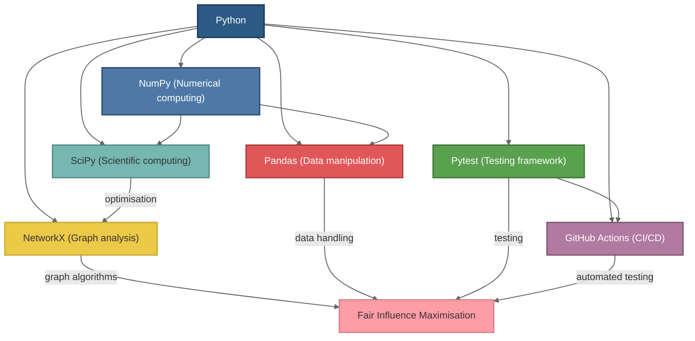

<a id="readme-top"></a>

<!-- PROJECT LOGO -->
<br />
<div align="center">
  <a href="https://github.com/Cabin320/fair_influence_maximisation">
    
  </a>

<h3 align="center">Fair Influence Maximisation with Non-Uniform Costs in Social Networks</h3>

  <p align="center">
    A Python-based project developing  a heuristic algorithm for cost-sensitive, fair influence maximisation in social networks.
    <br />
    <br />
    <a href="https://github.com/Cabin320/fair_influence_maximisation/actions/workflows/test.yml">
        </a>
    <a href="https://img.shields.io/badge/linting-flake8-blue">
        </a>
    <a href="https://img.shields.io/badge/python-3.12-blue&logoColor=white">
        </a>
  </p>
</div>

<!-- TABLE OF CONTENTS -->
<details>
  <summary>Table of Contents</summary>
  <ol>
    <li>
      <a href="#about-the-project">About The Project</a>
      <ul>
        <li><a href="#built-with">Built With</a></li>
      </ul>
    </li>
    <li>
      <a href="#getting-started">Getting Started</a>
      <ul>
        <li><a href="#prerequisites">Prerequisites</a></li>
        <li><a href="#installation">Installation</a></li>
      </ul>
    </li>
    <li><a href="#usage">Usage</a></li>
    <li><a href="#references">References</a></li>
  </ol>
</details>


<!-- ABOUT THE PROJECT -->

## About The Project

Influence spread involves modelling the propagation of ideas and other contagions through a network of agents. A central
challenge in this area is the problem of "maximising influence spread", which seeks to identify a seed set of nodes to
initiate the process and achieve the widest possible spread. 

As this problem is NP-hard, heuristics are often employed to approximate solutions. This project focuses on developing a heuristic for influence maximisation when nodes have
non-uniform costs, incorporating the concept of fair influence maximisation (FIM). FIM aims to ensure an equitable distribution of influence across communities within the network, reducing influence gaps while maximising overall
spread. 

The research will explore strategies to balance the dual objectives of maximising influence spread and promoting
fairness in the presence of cost variability, developing and evaluating new heuristics to address these challenges
effectively.

<p align="right">(<a href="#readme-top">back to top</a>)</p>

### Built With



<p align="right">(<a href="#readme-top">back to top</a>)</p>


<!-- GETTING STARTED -->

## Getting Started

To get a local copy up and running, follow these simple steps.

### Prerequisites

Ensure you have Python 3.12 installed. You can verify this by running:

```bash
python3 --version
```

It's recommended to use a virtual environment to manage dependencies:

```bash
python3 -m venv venv
source venv/bin/activate  # On Windows: venv\Scripts\activate
```

### Installation

1. Clone the Repository:

```bash
git clone https://github.com/Cabin320/fair_influence_maximisation.git
cd fair_influence_maximisation
```

2. Install dependencies:

```bash
pip install -r requirements.txt
```

3. Run tests (optional but recommended):
```bash
pytest tests/
```

<p align="right">(<a href="#readme-top">back to top</a>)</p>

## Usage

This project includes a suite of tools and scripts for experimenting with fair influence maximisation algorithms.

### Example Usage

To run the main influence maximisation heuristic:

<p align="right">(<a href="#readme-top">back to top</a>)</p>

## References

This project is inspired by and builds upon the following key works:

- D. Kempe, J. Kleinberg, and E. Tardos, “Maximizing the Spread of
Influence through a Social Network,” Cornell University, New York,
Tech. Rep., 8 2003. [Online]. Available: https://dl.acm.org/doi/abs/10.1145/956750.956769
- A. Tsang, B. Wilder, E. Rice, M. Tambe, and Y. Zick, “Group-Fairness
in Influence Maximization,” National University of Singapore, Tech.
Rep., 3 2019. [Online]. Available: http://arxiv.org/abs/1903.00967
- K. Ma, X. Xu, H. Yang, R. Cao, and L. Zhang, “Fair Influence
Maximization in Social Networks: A Community-Based Evolutionary
Algorithm,” Anhui University, Hefei, Tech. Rep., 11 2023. [Online].
Available: http://arxiv.org/abs/2311.14288
- A. Rahmattalabi, S. Jabbari, H. Lakkaraju, P. Vayanos, M. Izenberg,
R. Brown, E. Rice, and M. Tambe, “Fair Influence Maximization: A
Welfare Optimization Approach,” University of Southern California,
Tech. Rep., 6 2020. [Online]. Available: http://arxiv.org/abs/2006.07906


<p align="right">(<a href="#readme-top">back to top</a>)</p>


